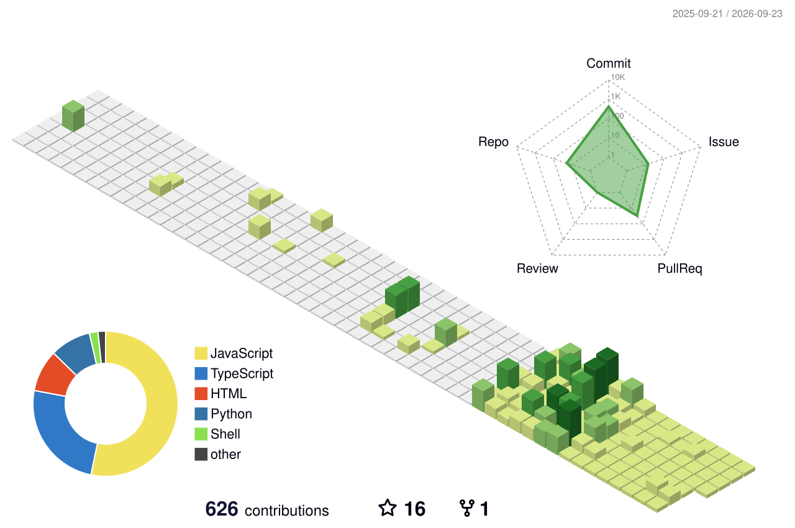

<div align="center">
  <!-- Right floated Chibi GIF -->
  
  
  <!-- Left floated Animation GIF
  
   -->
  <!-- Text content -->
  <h1 align="center" style="margin-top: 0;"><b>Yo! I'm Manvi</b></h1>
  <p align="center" style="font-weight: normal; font-size: 16px; line-height: 1.6;">I write code, break things, fix them, and somehow end up building cool stuff. Most of my time goes into web development, open source, hackathons, and chasing the next "this would be fun to build" idea. Currently on a mission to build, contribute, and become the kind of engineer who makes people say, "Wait... you built that?"</p>
</div>
<!-- <br clear="both" /> -->
<!-- [](https://linkedin.com/in/manvikmaboj)
[](https://dev.to/manvi_kamboj)
[](https://www.leetcode.com/master_17)
[](https://auth.geeksforgeeks.org/user/manvikamboj)
[](mailto:kamboj176manvi@gmail.com) -->

</div>

---

<h2 align="center">About Me</h2>

- Currently working on [Startora](https://github.com/Manvikamboz/Startora)
- Practicing problem solving with **C++**
<!-- , **GFG**, and **LeetCode** -->
- Ask me about **C++** and **DSA**
- Exploring backend development, databases, and clean project architecture
- Daily driver: **Linux Mint**

<h2 align="center">
  
  Tech Stack
  
</h2>

<div align="center">
  <kbd>
    <br>
    <table>
      <tr>
        <td align="center" valign="top" width="50%">
          <kbd><b>Languages</b></kbd>
          <br><br>
          
          
          
          
          
          
        </td>
        <td align="center" valign="top" width="50%">
          <kbd><b>Libraries & ML</b></kbd>
          <br><br>
          
          
          
          
          
        </td>
      </tr>
      <tr>
        <td align="center" valign="top" width="50%">
          <kbd><b>Web & Databases</b></kbd>
          <br><br>
          
          
          
          
          
          
          
          
        </td>
        <td align="center" valign="top" width="50%">
          <kbd><b>Tools & Platforms</b></kbd>
          <br><br>
          
          
          
          
          
        </td>
      </tr>
    </table>
  </kbd>
</div>

<!--
## Featured Project

### Startora

The open-source startup operating system for students. Think GitHub meets LinkedIn meets Y Combinator — built to help student founders discover teammates, validate ideas, and build venture-scale startups before they leave university.

[](https://github.com/Manvikamboz/Startora)

```cpp
while (bug.exists()) {
    cout << "It works on my machine" << endl;
    debug();
}
```
> Current mood: converting caffeine into accepted submissions.
-->

## GitHub Snapshot

<div align="center">


<br><br>


<br><br>


</div>

<!--
## Current Focus

| Focus Area | What I'm sharpening | Momentum |
| --- | --- | --- |
| **C++ DSA** | Daily problem-solving reps, clean logic, and pattern recognition | `██████░░░░` |
| **Open Source** | Contributing to real-world projects, reading codebases, and shipping fixes | `███████░░░` |
| **Linux Workflow** | Faster terminal habits, Git practice, and development setup | `████████░░` |
| **System Design** | Scalable architecture, design patterns, and clean project structure | `█████████░` |

**Now sharpening:** open source impact, system thinking, and deeper Linux fundamentals.
-->

## Open Source Contributions

My latest public pull requests, updated automatically:

<!--START_SECTION:contributions-->
| Pull Request | Related Issue | Repository | Status |
| --- | --- | --- | --- |
| [#93 fix(constants): correct Anthropic Opus model IDs](https://github.com/langchain-ai/openwiki/pull/93) | [#86 Two bugs in v0.0.1: Anthropic Opus model ID is invalid, and a single malformed tool call crashes the entire run](https://github.com/langchain-ai/openwiki/issues/86) | `langchain-ai/openwiki` | Open |
| [#92 fix(agent): handle tool validation errors gracefully](https://github.com/langchain-ai/openwiki/pull/92) | [#86 Two bugs in v0.0.1: Anthropic Opus model ID is invalid, and a single malformed tool call crashes the entire run](https://github.com/langchain-ai/openwiki/issues/86) | `langchain-ai/openwiki` | Open |
| [#111 Refactor theme system to configuration-driven key system and expand c…](https://github.com/srizzon/git-city/pull/111) | [#100 [Feature] Expand Theme System with Additional Color Palettes](https://github.com/srizzon/git-city/issues/100) | `srizzon/git-city` | Closed |
| [#4032 Fix race condition in PHPParserUnitTests caused by shared SQLite database](https://github.com/eranif/codelite/pull/4032) | [#4017 ctest failures](https://github.com/eranif/codelite/issues/4017) | `eranif/codelite` | Merged |
| [#8 docs: remove NEWCOMER_ISSUES.md from repository tracking (keep local …](https://github.com/Can-Startora/Startora/pull/8) | Not linked | `Can-Startora/Startora` | Merged |
<!--END_SECTION:contributions-->

---
